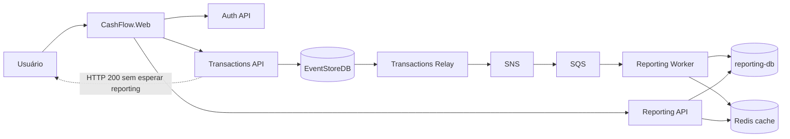

# Cash Flow — Controle de Fluxo de Caixa

Solução em **C# / .NET 10** para registro de lançamentos (débitos e créditos) e **consolidado diário**, com arquitetura de microsserviços orientada a eventos, alta disponibilidade no caminho de escrita e metas de performance documentadas para leitura de relatórios.

## Problema de negócio

Um comerciante precisa:

1. **Registrar lançamentos** diários (débito/crédito) de forma confiável.
2. **Consultar o saldo consolidado** do dia, com gráficos e exportação.

## Arquitetura (visão geral)



**Isolamento crítico (NFR):** o serviço de lançamentos **não depende** do consolidado. A gravação confirma após append no EventStore; a projeção para relatórios é assíncrona (SNS → SQS → Worker).

Diagramas C4 detalhados: [`docs/c4/`](docs/c4/).

## Pré-requisitos

### Ferramentas obrigatórias

| Ferramenta | Versão mínima | Observação |
|------------|---------------|------------|
| [.NET SDK](https://dotnet.microsoft.com/download) | **10.0** | `dotnet --version` deve retornar 10.x |
| [Docker Desktop](https://www.docker.com/products/docker-desktop/) | Engine em execução | WSL2 recomendado no Windows |
| PowerShell | 5.1+ (Windows) ou **7+** (Linux/macOS) | Scripts em `scripts/*.ps1` |

### Recursos recomendados

| Recurso | Mínimo sugerido |
|---------|-----------------|
| RAM | 8 GB livres (stack sobe SQL Server, EventStore, LocalStack, 3 relays, 3 workers) |
| CPU | 4 cores |
| Disco | ~5 GB para imagens Docker |

### Ferramentas opcionais

| Ferramenta | Quando ajuda |
|------------|--------------|
| [AWS CLI v2](https://aws.amazon.com/cli/) | Setup do Cognito Local mais rápido; sem CLI o script usa imagem `amazon/aws-cli` via Docker |
| [Aspire Dashboard](https://learn.microsoft.com/dotnet/aspire/fundamentals/dashboard) | Vem com o AppHost — confirme portas e saúde dos serviços |

### Primeira execução após clonar

Não é necessário criar `.env`, user-secrets ou editar `appsettings` para dev local. O fluxo padrão:

```powershell
dotnet restore Aspire.CashFlow.slnx   # primeira vez — baixa pacotes NuGet
.\scripts\run-full-local.ps1
```

Arquivos gerados em runtime (não versionados): `infra/**/generated/` — Cognito pool/client, filas SNS/SQS, etc.

## Onde configurar (mapa de referência)

Use esta tabela quando algo falhar ou precisar de ajuste fino.

| O quê | Onde configurar | Valor / padrão local |
|-------|-----------------|----------------------|
| **Orquestração Aspire** | `src/Aspire.CashFlow.AppHost/appsettings.Development.json` | Connection strings, Redis, réplicas, OTEL |
| **Réplicas (API / relay / worker)** | Env: `CASHFLOW_API_REPLICAS`, `CASHFLOW_RELAY_REPLICAS`, `CASHFLOW_REPORTING_WORKER_REPLICAS` ou `CashFlow:*Replicas` no AppHost | 1 / 3 / 3 |
| **SQL Server (reporting-db)** | `ConnectionStrings:reporting-db` no AppHost; senha em `infra/transactions-stack/docker-compose.yml` | `127.0.0.1:1433`, sa / `CashFlow@Dev123!` |
| **EventStoreDB** | `EventStore:ConnectionString` no AppHost | `esdb://127.0.0.1:2113?tls=false` |
| **Redis (cache de relatórios)** | `Reporting:Redis` no AppHost | `localhost:6379`, `Enabled: true` |
| **LocalStack (SNS/SQS/Secrets/KMS)** | `infra/localstack/docker-compose.yml` + scripts `setup-*.ps1` | `http://localhost:4566` |
| **Cognito Local** | Gerado em `infra/cognito-local/generated/cognito.env` pelo `setup-cognito.ps1` | `http://localhost:9229` |
| **Conta demo (login Web / load tests)** | `DemoAccount` no AppHost; usuário criado pelo setup Cognito | `admin@cashflow.docker` / `Pass@word1` / MFA `123456` |
| **JWT dev (sem Cognito)** | `Jwt:SigningKey` em `appsettings.Development.json` de cada API | Apenas dev — não usar em produção |
| **Rate limiting** | `Security:RateLimitingEnabled` — AppHost força `false` em reporting/transactions | Load tests exigem desligado |
| **Observabilidade (Prometheus/Grafana)** | `infra/observability/` + flag `-ObservabilityHttps` no `run-full-local.ps1` | Prometheus `:9090`, Grafana `:3000` |
| **URLs das APIs (load tests)** | Env: `CASHFLOW_AUTH_URL`, `CASHFLOW_TRANSACTIONS_URL`, `CASHFLOW_REPORTING_URL` | Ver tabela abaixo |
| **Portas Docker (conflitos)** | `infra/*/docker-compose.yml` — altere o mapeamento `127.0.0.1:PORTA` e alinhe connection strings | Ver tabela de portas |

### Portas fixas (Docker + APIs)

| Porta | Serviço |
|-------|---------|
| 1433 | SQL Server |
| 2113 | EventStore HTTP |
| 6379 | Redis |
| 4566 | LocalStack |
| 9229 | Cognito Local |
| 4318 / 8889 | OTEL Collector |
| 9090 | Prometheus |
| 3000 | Grafana |
| 5154 / **7204** | Auth API (HTTP / HTTPS) |
| 5100 / **7093** | Transactions API (HTTP / HTTPS) |
| 5292 / **7090** | Reporting API (HTTP / HTTPS) |
| 7262 | Web (UI) |

> **Conflito de porta:** o caso mais comum é **1433** já ocupada por outro SQL Server. Pare o serviço conflitante ou altere o mapeamento em `infra/transactions-stack/docker-compose.yml` e a connection string no AppHost.

> **Portas Aspire:** as APIs usam portas fixas via `launchSettings.json`. Se o Dashboard mostrar outra porta, ajuste as variáveis `CASHFLOW_*_URL` nos scripts de carga.

## Executar localmente

Na raiz do repositório:

```powershell
.\scripts\run-full-local.ps1
```

Opções úteis:

```powershell
# Prometheus/Grafana com scrape HTTPS (porta 7093)
.\scripts\run-full-local.ps1 -ObservabilityHttps

# Sem stack de observabilidade
.\scripts\run-full-local.ps1 -SkipObservability
```

Parar tudo:

```powershell
.\scripts\stop-full-local.ps1
```

### URLs (desenvolvimento Aspire)

| Serviço | URL típica |
|---------|------------|
| **Web (UI)** | https://localhost:7262 |
| **Auth API** | https://localhost:7204 |
| **Transactions API** | https://localhost:7093 |
| **Reporting API** | https://localhost:7090 |
| **Aspire Dashboard** | http://localhost:15888 (porta pode variar — ver terminal) |
| **Prometheus** | http://localhost:9090 |
| **Grafana** | http://localhost:3000 (admin / admin) |

> As portas exatas aparecem no **Aspire Dashboard** após o AppHost subir.

### Credenciais demo

| Campo | Valor |
|-------|-------|
| E-mail | `admin@cashflow.docker` |
| Senha | `Pass@word1` |
| MFA (local) | `123456` |

## Fluxo demo

1. Acesse a Web e faça login.
2. Registre um **crédito** e um **débito** na tela de fluxo de caixa.
3. Abra **Relatórios** e selecione a data dos lançamentos.
4. (Opcional) Exporte CSV/PDF e confira totais iguais ao dashboard.

## Testes

```powershell
dotnet test Aspire.CashFlow.slnx
```

Testes de integração usam `WebApplicationFactory` e, quando disponível, Docker (LocalStack / SQL).

### Isolamento Transactions ↔ Reporting

O teste `ReportingAvailabilityIsolationTests` prova que a Transactions API grava lançamentos **sem** serviços de reporting no pipeline HTTP.

Validação manual (stack rodando):

1. Pare `reporting-api` e `reporting-worker` no Aspire Dashboard.
2. `POST /api/transactions` com JWT — deve retornar **200**.
3. Suba reporting novamente — backlog SQS deve ser projetado.

## Teste de carga — consolidado (50 RPS / ≤ 5% perda)

Com a stack local em execução (`run-full-local.ps1` **deve permanecer ativo** — não pressione Ctrl+C antes):

```powershell
# Em outro terminal (stack rodando no primeiro)
.\scripts\run-reporting-load-test.ps1
```

Se acabou de subir a stack, aguarde endpoints:

```powershell
.\scripts\run-reporting-load-test.ps1 -WaitTimeoutSeconds 120
```

Ou diretamente (com stack já em execução — **use `--no-build`** para não recompilar e derrubar a `reporting-api`):

```powershell
dotnet build tests/CashFlow.Reporting.Benchmarks -p:BuildProjectReferences=false
dotnet run --project tests/CashFlow.Reporting.Benchmarks --no-build -- load `
  --url https://localhost:7090 `
  --auth-url https://localhost:7204 `
  --rate 50 `
  --duration 30
```

Metas em `docs/reporting-slo.md` e gates em `ReportingLoadTestSloGates.cs`: **50 RPS**, **≤ 5% falhas**, **média &lt; 200 ms** (leituras com cache).

### Teste de carga — Transactions (exploratório / stress)

Com a stack ativa, em **outro terminal**:

```powershell
.\scripts\run-transactions-load-test.ps1
```

URLs padrão: Auth `https://localhost:7204`, Transactions `https://localhost:7093`. Sobrescreva se necessário:

```powershell
$env:CASHFLOW_AUTH_URL = "https://localhost:7204"
$env:CASHFLOW_TRANSACTIONS_URL = "https://localhost:7093"
.\scripts\run-transactions-load-test.ps1
```

> Use `.\scripts\run-*-load-test.ps1` ou `dotnet run --no-build` — **nunca** `dotnet run` sem `--no-build` com a stack rodando (recompila a API e derruba o processo no Aspire).

### Lint e formatação

```powershell
.\scripts\lint.ps1        # CSharpier + analisadores (build)
.\scripts\lint.ps1 -Fix   # analisadores + formatação CSharpier
.\scripts\security-audit.ps1   # vulnerabilidades em pacotes + SAST no código
```

Relatórios de execução: [`tests/CashFlow.Reporting.Benchmarks/reports/`](tests/CashFlow.Reporting.Benchmarks/reports/).

## Estrutura do repositório

```text
AspireApp1/
├── src/
│   ├── Aspire.CashFlow.AppHost/          # Orquestração .NET Aspire
│   ├── Aspire.CashFlow.ServiceDefaults/  # Auth, observabilidade, segurança compartilhada
│   ├── CashFlow.Auth.Api/
│   ├── CashFlow.Transactions.Api/
│   ├── CashFlow.Transactions.Relay/
│   ├── CashFlow.Reporting.Api/
│   ├── CashFlow.Reporting.Worker/
│   └── CashFlow.Web/
├── tests/                       # Unitários, integração, contrato, benchmarks
├── docs/                        # ADRs, SLOs, C4, roadmap, constituição
├── specs/                       # Especificações e planos por feature
├── infra/                       # Docker Compose (LocalStack, EventStore, observabilidade)
└── scripts/                     # run-full-local.ps1, lint.ps1, testes de carga
```

## Documentação

| Documento | Descrição |
|-----------|-----------|
| [Índice de docs](docs/README.md) | Mapa da documentação (ADRs 000–003) |
| [Rastreabilidade / gaps](docs/rastreabilidade-gaps-checklist.md) | Checklist do desafio |
| [ADR 000 — Governança](docs/adr/000-governanca-decisoes-arquiteturais.md) | Critérios e 3 categorias de ADR |
| [ADR 001 — Arquitetura](docs/adr/001-arquitetura-estrutural-e-dados.md) | Microsserviços, CQRS, NFR-01 |
| [ADR 002 — Infraestrutura](docs/adr/002-infraestrutura-stack-recursos.md) | EventStore, SNS/SQS, SQL, Redis |
| [ADR 003 — Segurança](docs/adr/003-seguranca-cognito-jwt.md) | Cognito + JWT |
| [SLO Transactions](docs/transactions-slo.md) | Métricas do caminho de escrita |
| [SLO Reporting](docs/reporting-slo.md) | Métricas do consolidado |
| [Observabilidade pipeline](docs/messaging-pipeline-observability.md) | EventStore → SQS |
| [Roadmap](docs/roadmap.md) | Evoluções futuras |

## Repositório GitHub

> **Ação pendente:** publique este repositório no GitHub e substitua a URL abaixo.

`https://github.com/<seu-usuario>/Aspire.CashFlow`

## CI

Pipeline GitHub Actions: [`.github/workflows/ci.yml`](.github/workflows/ci.yml) — `dotnet build` + `dotnet test` em cada push/PR.

## Evoluções futuras

Resumo — detalhes em [`docs/roadmap.md`](docs/roadmap.md):

- Deploy em **Kubernetes** com HPA para API/Worker e load balancer HTTP.
- **Cognito Admin** para gestão real de usuários.
- Federação **AD/SAML/OIDC**.
- Reavaliação de **DynamoDB** para idempotência de projeção em escala extrema (ADR 002, seção modelo de leitura).
- Secrets e JWT de produção via **AWS Secrets Manager** (sem chaves dev em `appsettings`).

## FAQ — problemas comuns

### Preciso configurar algo manualmente ao clonar o repo?

**Não**, para dev local padrão. Docker + .NET 10 + PowerShell bastam. O `run-full-local.ps1` provisiona LocalStack, Cognito, filas, secrets e injeta variáveis de ambiente no AppHost. Arquivos em `infra/**/generated/` são criados automaticamente.

### `run-full-local.ps1` falha ao subir Docker / porta em uso

1. Confirme que o Docker Desktop está **rodando**.
2. Verifique conflitos na tabela de portas (seção [Onde configurar](#onde-configurar-mapa-de-referência)) — especialmente **1433** (SQL Server).
3. Pare restos de execuções anteriores: `.\scripts\stop-full-local.ps1`
4. Se alterou portas no `docker-compose.yml`, atualize `ConnectionStrings:reporting-db` e demais endpoints no AppHost.

### Cognito / login não funciona após subir a stack

- Aguarde `Cognito Local ready` no terminal do `run-full-local.ps1`.
- Pool e client IDs **não** vêm do `appsettings` estático — são gerados em `infra/cognito-local/generated/cognito.env` e injetados pelo script.
- Credenciais demo: `admin@cashflow.docker` / `Pass@word1` / MFA `123456`.
- Se rodar o AppHost **sem** `run-full-local.ps1`, defina `CASHFLOW_COGNITO_ENABLED=true` e carregue o `cognito.env`, ou use `CASHFLOW_AUTO_LOAD_COGNITO_LOCAL=true`.

### Load test diz que Auth ou Reporting estão inacessíveis

1. O `run-full-local.ps1` deve **continuar rodando** no primeiro terminal (não pressione Ctrl+C).
2. Aguarde `Distributed application started` no Aspire Dashboard.
3. Use `-WaitTimeoutSeconds 120` no script de reporting.
4. Confirme URLs no Dashboard; se diferentes, exporte `CASHFLOW_AUTH_URL` e `CASHFLOW_REPORTING_URL`.
5. Compile benchmarks **antes** ou deixe o script fazer: `dotnet build tests/CashFlow.Reporting.Benchmarks -p:BuildProjectReferences=false`.

### O teste de carga derrubou a `reporting-api` / Aspire

Causa típica: `dotnet run --project tests/CashFlow.Reporting.Benchmarks` **sem** `--no-build` recompila `CashFlow.Reporting.Api` (referência do projeto) e encerra o processo em execução.

**Solução:** use `.\scripts\run-reporting-load-test.ps1` ou `dotnet run --no-build`.

### HTTP 429 no load test de reporting

Rate limiting está ativo. Em dev o AppHost define `Security__RateLimitingEnabled=false`. Reinicie a stack via `run-full-local.ps1` ou confira `Security:RateLimitingEnabled` em `appsettings.Development.json` da Reporting API.

### Grafana / Prometheus vazio após carga

- Prometheus: http://localhost:9090 → Status → Targets.
- Transactions HTTPS: `:7093/metrics`; Reporting: `:7090/metrics`.
- Com `-ObservabilityHttps`, use scrape HTTPS (cert dev ignorado no Prometheus).
- Detalhes: [`docs/transactions-slo.md`](docs/transactions-slo.md) e [`docs/messaging-pipeline-observability.md`](docs/messaging-pipeline-observability.md).

### Relatório sem dados no load test

O gate de reporting usa data fixa `2026-06-12` por padrão. Funciona com cache vazio (zero state). Para dados reais, registre lançamentos na Web e passe `--report-date` com a data usada.

### Máquina lenta ou falta de memória

Reduza réplicas antes de subir a stack:

```powershell
$env:CASHFLOW_RELAY_REPLICAS = "1"
$env:CASHFLOW_REPORTING_WORKER_REPLICAS = "1"
.\scripts\run-full-local.ps1 -SkipObservability
```

### Linux / macOS

Scripts são PowerShell — instale [PowerShell 7+](https://github.com/PowerShell/PowerShell). Docker Desktop deve expor `host.docker.internal` (observabilidade). Caminhos usam `\`; execute a partir da raiz do repo com `pwsh ./scripts/run-full-local.ps1`.

### `dotnet test` falha em testes de integração

Testes de integração SQL/Redis **pulam** automaticamente se Docker não estiver disponível. Para executá-los, suba a stack (`run-full-local.ps1`) ou apenas os containers necessários (SQL + Redis + LocalStack).

### Onde estão os SLOs e gates de performance?

| Caminho | Conteúdo |
|---------|----------|
| [`docs/reporting-slo.md`](docs/reporting-slo.md) | 50 RPS, 5% perda, latência cacheada |
| [`docs/transactions-slo.md`](docs/transactions-slo.md) | Caminho de escrita / persistência |
| `tests/CashFlow.Reporting.Benchmarks/ReportingLoadTestSloGates.cs` | Gates automatizados (reporting) |
| `tests/CashFlow.Transactions.Benchmarks/TransactionLoadTestSloGates.cs` | Gates automatizados (transactions) |

## Licença

Projeto de demonstração arquitetural — ajuste conforme necessário antes de uso em produção.
