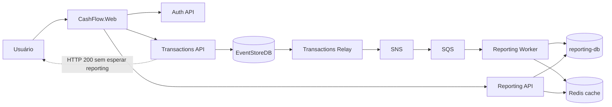

# Cash Flow — Controle de Fluxo de Caixa

Solução em **C# / .NET 10** para registro de lançamentos (débitos e créditos) e **consolidado diário**, com arquitetura de microsserviços orientada a eventos, alta disponibilidade no caminho de escrita e metas de performance documentadas para leitura de relatórios.

## Problema de negócio

Um comerciante precisa:

1. **Registrar lançamentos** diários (débito/crédito) de forma confiável.
2. **Consultar o saldo consolidado** do dia, com gráficos e exportação.

## Arquitetura (visão geral)



**Isolamento crítico (NFR):** o serviço de lançamentos **não depende** do consolidado. A gravação confirma após append no EventStore; a projeção para relatórios é assíncrona (SNS → SQS → Worker).

Diagramas C4 detalhados: [`docs/c4/`](docs/c4/).

## Pré-requisitos

| Ferramenta | Versão mínima |
|------------|---------------|
| [.NET SDK](https://dotnet.microsoft.com/download) | 10.0 |
| [Docker Desktop](https://www.docker.com/products/docker-desktop/) | Com engine em execução |
| PowerShell | 5.1+ (Windows) ou PowerShell 7+ |

## Executar localmente

Na raiz do repositório:

```powershell
.\scripts\run-full-local.ps1
```

Opções úteis:

```powershell
# Prometheus/Grafana com scrape HTTPS (porta 7093)
.\scripts\run-full-local.ps1 -ObservabilityHttps

# Sem stack de observabilidade
.\scripts\run-full-local.ps1 -SkipObservability
```

Parar tudo:

```powershell
.\scripts\stop-full-local.ps1
```

### URLs (desenvolvimento Aspire)

| Serviço | URL típica |
|---------|------------|
| **Web (UI)** | https://localhost:7262 |
| **Auth API** | https://localhost:7204 |
| **Transactions API** | https://localhost:7093 |
| **Reporting API** | https://localhost:7090 |
| **Aspire Dashboard** | http://localhost:15888 (porta pode variar — ver terminal) |
| **Prometheus** | http://localhost:9090 |
| **Grafana** | http://localhost:3000 (admin / admin) |

> As portas exatas aparecem no **Aspire Dashboard** após o AppHost subir.

### Credenciais demo

| Campo | Valor |
|-------|-------|
| E-mail | `admin@cashflow.docker` |
| Senha | `Pass@word1` |
| MFA (local) | `123456` |

## Fluxo demo

1. Acesse a Web e faça login.
2. Registre um **crédito** e um **débito** na tela de fluxo de caixa.
3. Abra **Relatórios** e selecione a data dos lançamentos.
4. (Opcional) Exporte CSV/PDF e confira totais iguais ao dashboard.

## Testes

```powershell
dotnet test AspireApp1.slnx
```

Testes de integração usam `WebApplicationFactory` e, quando disponível, Docker (LocalStack / SQL).

### Isolamento Transactions ↔ Reporting

O teste `ReportingAvailabilityIsolationTests` prova que a Transactions API grava lançamentos **sem** serviços de reporting no pipeline HTTP.

Validação manual (stack rodando):

1. Pare `reporting-api` e `reporting-worker` no Aspire Dashboard.
2. `POST /api/transactions` com JWT — deve retornar **200**.
3. Suba reporting novamente — backlog SQS deve ser projetado.

## Teste de carga — consolidado (50 RPS / ≤ 5% perda)

Com a stack local em execução (`run-full-local.ps1` **deve permanecer ativo** — não pressione Ctrl+C antes):

```powershell
# Em outro terminal (stack rodando no primeiro)
.\scripts\run-reporting-load-test.ps1
```

Se acabou de subir a stack, aguarde endpoints:

```powershell
.\scripts\run-reporting-load-test.ps1 -WaitTimeoutSeconds 120
```

Ou diretamente:

```powershell
dotnet run --project tests/CashFlow.Reporting.Benchmarks -- load `
  --url https://localhost:7090 `
  --auth-url https://localhost:7204 `
  --rate 50 `
  --duration 30
```

Metas em `ReportingSlo.cs`: **50 RPS**, **≤ 5% falhas**, **média &lt; 200 ms** (leituras com cache).

Relatórios de execução: [`tests/CashFlow.Reporting.Benchmarks/reports/`](tests/CashFlow.Reporting.Benchmarks/reports/).

## Estrutura do repositório

```text
AspireApp1/
├── AspireApp1.AppHost/          # Orquestração .NET Aspire
├── AspireApp1.ServiceDefaults/  # Auth, observabilidade, segurança compartilhada
├── src/                         # Auth, Transactions, Relay, Reporting, Web
├── tests/                       # Unitários, integração, contrato, benchmarks
├── docs/                        # ADRs, SLOs, C4, roadmap, constituição
├── specs/                       # Especificações e planos por feature
├── infra/                       # Docker Compose (LocalStack, EventStore, observabilidade)
├── scripts/                     # run-full-local.ps1, testes de carga
└── tools/spec-kit/              # Spec Kit local (gitignored)
```

## Documentação

| Documento | Descrição |
|-----------|-----------|
| [Índice de docs](docs/README.md) | Mapa da documentação (ADRs 000–003) |
| [Rastreabilidade / gaps](docs/rastreabilidade-gaps-checklist.md) | Checklist do desafio |
| [ADR 000 — Governança](docs/adr/000-governanca-decisoes-arquiteturais.md) | Critérios e 3 categorias de ADR |
| [ADR 001 — Arquitetura](docs/adr/001-arquitetura-estrutural-e-dados.md) | Microsserviços, CQRS, NFR-01 |
| [ADR 002 — Infraestrutura](docs/adr/002-infraestrutura-stack-recursos.md) | EventStore, SNS/SQS, SQL, Redis |
| [ADR 003 — Segurança](docs/adr/003-seguranca-cognito-jwt.md) | Cognito + JWT |
| [SLO Transactions](docs/transactions-slo.md) | Métricas do caminho de escrita |
| [SLO Reporting](docs/reporting-slo.md) | Métricas do consolidado |
| [Observabilidade pipeline](docs/messaging-pipeline-observability.md) | EventStore → SQS |
| [Roadmap](docs/roadmap.md) | Evoluções futuras |

## Repositório GitHub

> **Ação pendente:** publique este repositório no GitHub e substitua a URL abaixo.

`https://github.com/<seu-usuario>/AspireApp1`

## CI

Pipeline GitHub Actions: [`.github/workflows/ci.yml`](.github/workflows/ci.yml) — `dotnet build` + `dotnet test` em cada push/PR.

## Evoluções futuras

Resumo — detalhes em [`docs/roadmap.md`](docs/roadmap.md):

- Deploy em **Kubernetes** com HPA para API/Worker e load balancer HTTP.
- **Cognito Admin** para gestão real de usuários.
- Federação **AD/SAML/OIDC**.
- Reavaliação de **DynamoDB** para idempotência de projeção em escala extrema (ADR 002, seção modelo de leitura).
- Secrets e JWT de produção via **AWS Secrets Manager** (sem chaves dev em `appsettings`).

## Licença

Projeto de demonstração arquitetural — ajuste conforme necessário antes de uso em produção.
