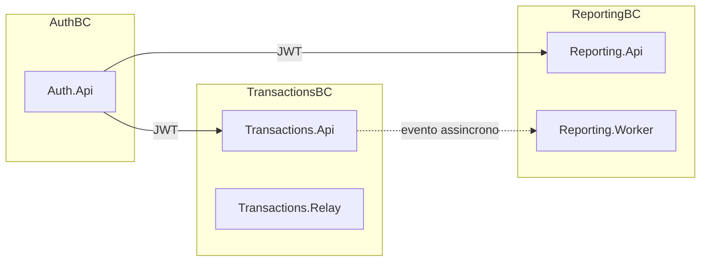

# ADR 001: Arquitetura estrutural e de dados

**Categoria:** Arquitetural

## Status

**Aceito** (2026-06-16). Consolida decisões de estrutura, padrões internos, modelo de dados e isolamento NFR-01.

## Data

2026-06-16

## Objetivos de negócio afetados

| ID | Objetivo | Impacto |
|----|----------|---------|
| RN-01 | Controle de lançamentos | `Transactions.Api` + `Transactions.Relay` como capacidade isolada |
| RN-02 | Consolidado diário | `Reporting.Api` + `Reporting.Worker` escaláveis independentemente |
| NFR-01 | Lançamentos não caem se reporting cair | Caminho de escrita desacoplado do de leitura |
| NFR-02 | 50 RPS no consolidado | Caminho de leitura stateless + projeção O(1) |

## Pilares NFR

| Pilar | Relevância | Como esta ADR atende |
|-------|------------|----------------------|
| Performance | Alta | APIs stateless; append único na escrita; leitura O(1) + cache |
| Disponibilidade | Alta | BCs isolados; relay/worker fora do HTTP |
| Confiabilidade | Alta | SSOT imutável; projeções idempotentes |
| Manutenibilidade | Alta | Camadas por serviço; 3 ADRs de decisão |
| Escalabilidade | Alta | Réplicas independentes API/Relay/Worker |
| Evolvabilidade | Alta | Novos consumidores/relatórios sem alterar BC de lançamentos |

## Contexto

O desafio exige **microsserviços**, **padrões arquiteturais** (SOLID, Clean Architecture) e **integração assíncrona**. O volume (~50–100 RPS exploratório) **não** exige microsserviços por escala — a decisão é motivada por **fronteiras de negócio**, **NFR-01** e demonstração arquitetural.

Recursos concretos (EventStore, SNS, SQL): [ADR 002 — Infraestrutura](002-infraestrutura-stack-recursos.md). Identidade: [ADR 003 — Segurança](003-seguranca-cognito-jwt.md).

### Bounded contexts



---

## 1. Decomposição macro — microsserviços por bounded context

| Serviço | Bounded context | Deploy |
|---------|-----------------|--------|
| `CashFlow.Auth.Api` | Identidade e tokens | API stateless |
| `CashFlow.Transactions.Api` | Comandos de lançamento | API stateless |
| `CashFlow.Transactions.Relay` | Integração assíncrona | Worker |
| `CashFlow.Reporting.Api` | Consultas e exportação | API stateless |
| `CashFlow.Reporting.Worker` | Projeção de eventos | Worker |
| `CashFlow.Web` | UI Blazor | Front |

### Comparativo macro

| Critério | Peso | Monólito | **Microsserviços** | Modular monolith |
|----------|------|----------|-------------------|------------------|
| Disponibilidade (NFR-01) | 25% | 2 | **5** | 3 |
| Escalabilidade independente | 20% | 2 | **5** | 3 |
| Manutenibilidade / BCs | 15% | 4 | **4** | 4 |
| Alinhamento desafio | 15% | 2 | **5** | 3 |
| Simplicidade operacional | 15% | **5** | 3 | 4 |
| Performance (volume atual) | 10% | **5** | 4 | 4 |
| **Total ponderado** | | ~3,0 | **~4,4** | ~3,4 |

**Rejeitados:** monólito modular (não isola NFR-01); modular monolith + workers (acopla relay à API).

---

## 2. Estrutura interna — Clean Architecture + Hexagonal

Por serviço (ex.: `CashFlow.Transactions.Api`):

```text
Domain/           → entidades, value objects
Application/      → use cases, abstractions (ports)
Infrastructure/   → adapters (EventStore, SNS, EF)
Endpoints/        → Minimal APIs
Configuration/    → DI
```

| Port | Adapter |
|------|---------|
| `ITransactionRepository` | `EventStoreTransactionRepository` |
| `ITransactionEventPublisher` | `SnsTransactionEventPublisher` / `NullTransactionEventPublisher` |

Alinhamento à constituição (Maintainability First, SOLID). Um `.csproj` por serviço — sem lib de domínio compartilhada entre BCs.

---

## 3. Modelo de dados — CQRS pragmático + Event Sourcing parcial

Lançamentos exigem **histórico imutável** e **consultas agregadas rápidas**. Um único modelo relacional mutável atende mal ambos.

| Lado | Store | Papel | Mutável? |
|------|-------|-------|----------|
| **Command** | EventStoreDB | SSOT de `TransactionRecorded` | Não (append-only) |
| **Query** | SQL `reporting-db` | `DailySummaries`, `ProjectedTransactions` | Sim (projeção) |
| **Cache** | Redis | `report:{userId}:{date}` | Sim (efêmero) |

### Comparativo de modelo

| Critério | Peso | SQL CRUD | ES puro | **CQRS pragmático** |
|----------|------|----------|---------|---------------------|
| Imutabilidade / auditoria | 25% | 2 | 5 | **5** |
| Performance leitura (50 RPS) | 25% | 3 | 1 | **5** |
| Performance escrita | 15% | 4 | 5 | **5** |
| Alinhamento constituição | 15% | 2 | 5 | **5** |
| Simplicidade | 20% | **5** | 2 | 3 |
| **Total ponderado** | | ~3,0 | ~3,5 | **~4,6** |

**Rejeitados:** SQL como único SSOT; Event Sourcing completo na leitura (O(n) inviável para 50 RPS).

Regras: HTTP 200 só após append durável; projeção at-least-once idempotente; novos modelos de leitura = novos projetores sem alterar eventos passados.

---

## 4. Isolamento NFR-01 — decomposição escrita/leitura

Requisito eliminatório: **lançamentos continuam se reporting cair**.

| Componente | Papel | No request HTTP? |
|------------|-------|------------------|
| `Transactions.Api` | Append EventStore | Sim |
| `Transactions.Relay` | Subscription → SNS | Não |
| `Reporting.Worker` | SQS → SQL | Não |
| `Reporting.Api` | GET relatórios | Não |

| Controle | Implementação |
|----------|---------------|
| Sem publish na API | `NullTransactionEventPublisher` |
| Relay isolado | `CashFlow.Transactions.Relay` |
| Health só escrita | `/ready` Transactions — só EventStore |
| Handler | `CreateTransactionHandler` — só `ITransactionRepository` |

```text
POST → EventStore → HTTP 200
         │ (async — falha não reverte lançamento)
         ▼
     Relay → SNS → SQS → Worker → reporting-db
```

**Rejeitados:** projeção inline no POST (viola NFR-01); relay no mesmo processo da API.

Evidência: `ReportingAvailabilityIsolationTests` (3 testes). Fluxos: [`c4/data-flows.md`](../c4/data-flows.md).

---

## Decisão (síntese)

Arquitetura **composta**:

1. **Macro:** microsserviços por capacidade de negócio (Auth / Lançamentos / Consolidação).
2. **Micro:** Clean Architecture + Hexagonal em cada serviço.
3. **Dados:** CQRS pragmático — EventStore (command) + SQL/Redis (query).
4. **Disponibilidade:** caminho de escrita mínimo; integração assíncrona em workers dedicados.

---

## Consequências

### Positivas

- Fronteiras alinhadas a RN-01/RN-02 e NFR-01 demonstrável
- Código testável via ports/adapters
- Caminho de leitura atinge SLO sem varrer eventos

### Negativas

- Mais containers que monólito
- Consistência eventual entre lançamento e consolidado
- Complexidade cognitiva (dois modelos de dados)

---

## Critério de reavaliação

- Equipe pequena + custo ops proibitivo → modular monolith mantendo ports
- Requisito de leitura imediata após escrita no POST → conflita com NFR-01
- Novo bounded context → novo serviço, não expandir Transactions monoliticamente

---

## Referências

- [ADR 000 — Governança](000-governanca-decisoes-arquiteturais.md)
- [ADR 002 — Infraestrutura](002-infraestrutura-stack-recursos.md)
- [ADR 003 — Segurança](003-seguranca-cognito-jwt.md)
- [`c4/containers.md`](../c4/containers.md)
- [Constituição](../constitution.md)

## Histórico

| Versão | Data | Nota |
|--------|------|------|
| 1.0 | 2026-06-16 | Aceito; substitui ADRs arquivadas 006, 007, 009 |
