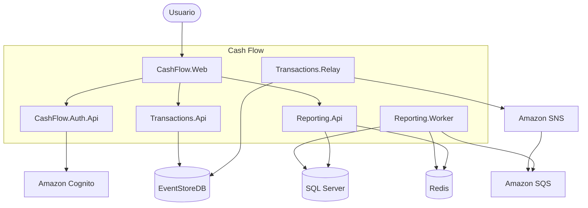

# C4 — Nível 2: Containers

Decomposição interna do sistema Cash Flow.

## Escalabilidade horizontal (local / produção)

| Container | Estratégia |
|-----------|------------|
| Transactions API | Stateless; réplicas atrás de load balancer |
| Transactions Relay | `WithReplicas(N)` no AppHost; subscription compartilhada |
| Reporting API | Stateless; cache Redis compartilhado |
| Reporting Worker | `WithReplicas(N)`; competição na fila SQS |

Em **dev**, escala via `WithReplicas(N)` no AppHost (.NET Aspire). Em **produção**, ver [`../roadmap.md`](../roadmap.md) (Kubernetes + ALB/Ingress).
