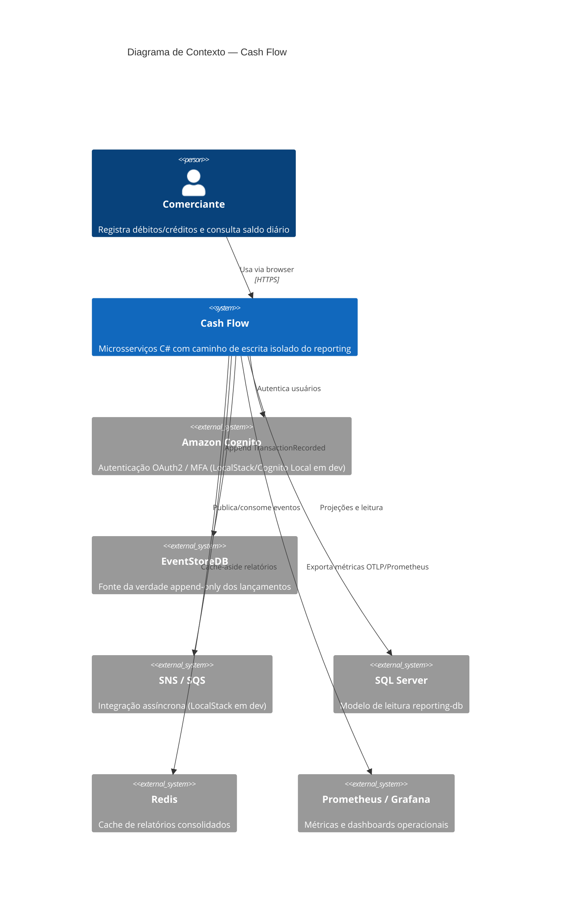

# C4 — Nível 1: Contexto

Sistema de controle de fluxo de caixa para comerciantes registrarem lançamentos e consultarem consolidado diário.

## Responsabilidades externas

| Sistema | Papel |
|---------|-------|
| Cognito | Identidade, MFA, tokens JWT |
| EventStoreDB | Durabilidade e imutabilidade dos lançamentos |
| SNS/SQS | Desacoplamento temporal entre escrita e modelo de leitura |
| SQL Server | `DailySummaries` e detalhes projetados |
| Redis | Aceleração de `GET /api/reports/daily` |
| Prometheus/Grafana | SLI/SLO operacionais |
